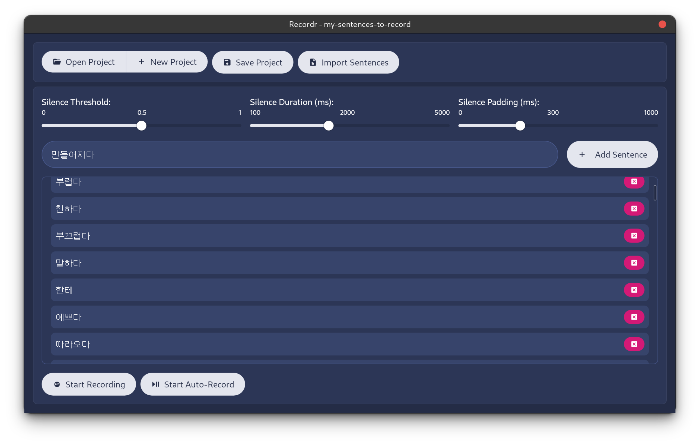

# Recordr

> [!WARNING]
> Recordr is currently Alpha software. It has been tested on Mac and Linux. There is a Windows build, but it has yet to be thoroughly tested. There may be bugs and unexpected behavior.
> 
> If you experience an issue, please [report an issue](https://github.com/benjaminkitt/recordr/issues/new). Pull Requests are always welcome!

# Recordr

## Description

Recordr is a Desktop application designed for recording snippets of speech. It's primary use case is to record sentences for language learning decks and apps, where many example sentences need to be recorded into individual audio files. If your use case requires recording a bunch of snippets of speech, Recordr is the app for you.



## Features

*   Add sentences to record individually, or import a list of sentences from a text file.
*   Use the auto-record feature to record multiple sentences at once. Recordr will automatically detect pauses in your speech and move on to the next sentence. Completely hands free!
*   Record or re-record individual sentences.
*   Silence before and after each sentence is automatically trimmed to your desired length.
*   Sentences are recorded to individual audio files, ready to be imported directly into decks, applications, and more.
*   Play back recorded sentences.
*   Create and save multiple projects.

## Installation

Recordr can be downloaded from the [Releases page](https://github.com/benjaminkitt/recordr/releases/latest).

* For Linux, Redhat (RPM) Debian (DEB) and AppImage packages are available.
* For Mac M1+ processors, aarch64 DMG packages are available.
* For Mac Intel processors, x86_64 DMG packages are available.
* For Windows, MSI and Setup files are available.

## Usage

### Create a new project

When creating a project, Recordr will create a folder for the project that will contain project files and audio files for the project. Simply select the location where you want Record to create the project folder, then give it a name.

### Add sentences

You can add sentences one at a time, or import a list of sentences from a text file. You may provide a .txt .csv or .tsv file when importing sentences. The only requirement is that each sentence is on a separate line.

### Start recording audio

To auto-record sentences, simply click the "Auto Record" button. Recordr will automatically detect pauses in your speech and move on to the next sentence. Sentences will be recorded as .wav files in your project directory.

## Development

### Dependencies

A [Nix Dev Shell](./flake.nix) is provided to simplify the installation and setup of the development environment. You will need the [Nix package manager](https://nixos.org/download) installed to use the flake. Once installed, run

```bash
nix develop
```
to enter the ephemeral development environment. This will download the necessary packages and place you into a bash shell.

Finally, install the Node dependencies by running

```bash
yarn install
```

### Running the App

#### Development

Run in development with hot reloading of the front end:

```bash
yarn tauri:dev
```
or with debug or trace logging:

```bash
yarn tauri:debug
yarn tauri:trace
```
When in development, you can use the built in chrome devtools to debug the app. Open them by pressing `Cmd+Shift+I` on Mac or `Ctrl+Shift+I` on Windows.

#### Debugging the backend

If using VS Code, you can launch the pre-configured debugger by pressing `F5`.

Otherwise, first build the app and start the front end dev server:

```bash
yarn tauri:build:debug
yarn dev
```
Then launch the app using your favorite Rust debugger. The path to the app is `./src-tauri/target/debug/recordr`. 

## Acknowledgements
Recordr was inspired by [Shtooka Recorder](https://fsi-languages.yojik.eu/oldshtooka/Shtooka%20Recorder%20-%20Shtooka%20Project.html) and is built on the hard work of many open source projects, including:
* [Tauri](https://tauri.app/)
* [SvelteKit](https://kit.svelte.dev/)
* [Node.js](https://nodejs.org/en/)
* [Rust](https://www.rust-lang.org/)
* [WebRTC](https://webrtc.org/)
* [CPAL](https://crates.io/crates/cpal)
* [Hound](https://github.com/ruuda/hound)
* [Silero VAD](https://github.com/snakers4/silero-vad)

And many more!

Thank you to all the contributors and maintainers of these projects!

## License

[Mozilla Public License Version 2.0](./LICENSE)
